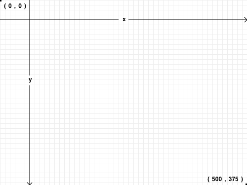

Pong
====

experimenting with HTML5 Canvas

<h1>HTML5 Canvas</h1>
<h2>Canvas Diagram</h2>

<h3>1. What problem does it solve?</h3>

 It allows us to draw objects in the browser by creating a canvas. We can manipulate the canvas using css and javascript to create layers and animate the drawings all without using a plug-in. Because the graphics are created at runtime on the user’s system, they’re always up-to-date and generate no server load or round-trip delay!

<h3>2. How does it do it (conceptually)?</h3>

 Provides an object that represents a two-dimensional surface(width and height) that has an origin (0,0) at the upper-left corner, with x-coordinates increasing as you move right and y-coordinates increasing as you move down. We can then fill in coordinates using methods from the canvas 2d API 

<h3>3. Why would I use it?</h3>

 You would use it if you wanted to render any kind of visual image without first loading something like flash, which requires download time 

<h3>4. What are the alternatives?</h3>

SVG, which is vector based. SVG was the early standard for drawing shapes in the browser and Flash, which is being phased out.

<h3>5. What is the history of this technology?
 Who built and why?</h3>

Canvas was introduced by Apple in 2004. It was used inside their Mac OS X WebKit   component to power dashboard applications and their Safari web browser. It was created as an html alternative to SVG which uses XML

<h3>6. What is your opinion on the technology after having built something with it?</h3>

Canvas is a useful tool for simple HTML5 graphics.

